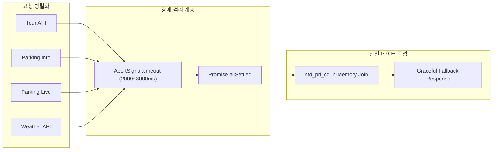

# 🔄 데이터 수집 및 파이프라인 명세서 (Data Pipeline Specification)
> **서비스명**: 안붐벼 (전국 실시간 축제·명소 밀집도 & 주차 정보 통합 플랫폼)  
> **최종 개정일**: 2026-08-24  
> **문서 버전**: v1.0.0

---

## 1. 외부 공공데이터 엔드포인트 및 수집 규격

안붐벼는 4대 공공데이터 API를 비동기 병렬 수신하여 실시간 데이터를 구성합니다.

| API 구분 | 제공 기관 | 엔드포인트 URL | 주요 수신 파라미터 |
|---|---|---|---|
| **축제 정보 API** | 한국관광공사 | `https://apis.data.go.kr/B551011/KorService1/searchFestival2` | `eventStartDate={YYYYMMDD}`, `arrange=R`, `numOfRows=50` |
| **명소/POI API** | 한국관광공사 | `https://apis.data.go.kr/B551011/KorService1/locationBasedList2` | `mapX`, `mapY`, `radius=20000`, `contentTypeId={12\|14}` |
| **주차장 기본정보** | 디지털융합플랫폼 / 공공데이터포털 | `https://api.koreaconnect.kr/.../parking/info` | `pageNo=1`, `pageSize=1000`, `addr_cd={시군구5자리}`, `addr_type=SIGUNGU` |
| **실시간 주차 잔여석** | 5대 지자체 연동 플랫폼 | `https://api.koreaconnect.kr/.../parking/status` | `pageNo=1`, `pageSize=1000`, `addr_cd={시군구5자리}`, `addr_type=SIGUNGU` |
| **실시간 기상 정보** | Koreaconnect 기상청 연동 | `https://api.koreaconnect.kr/.../ENVIRO/data/2.5/weather` | `lat={위도}`, `lon={경도}`, `units=metric`, `lang=kr`, `mode=json` |

---

## 2. 서버 사이드 캐싱 정책 (Caching Policy)

공공데이터포털 API의 일일 호출 한도(Rate Limit) 초과를 방어하고 사용자의 탭 전환 속도를 극대화하기 위해 Route Handler 메모리에 캐시 계층을 배치했습니다.

```typescript
// 캐시 저장소 인터페이스
interface CacheEntry {
  data: { success: boolean; data: Festival[] };
  timestamp: number;
}

const apiCache = new Map<string, CacheEntry>();
const CACHE_TTL_MS = 60 * 1000; // 60초 TTL (실시간성 보장과 트래픽 절감 균형)
```

### 캐시 키 생성 및 수명 주기
- **캐시 키 포맷**: `${category}_${region}_${mapX}_${mapY}_${radius}`
- **수명 주기**:
  1. 클라이언트 요청 인입 시 `Date.now() - cached.timestamp < CACHE_TTL_MS` 검사.
  2. 60초 이내 요청 시 외부 API 호출 없이 즉시 JSON 응답 반환 (응답 시간 < 5ms).
  3. 60초 경과 시 파이프라인 재실행 후 신규 데이터로 캐시 갱신.

---

## 3. 비동기 장애 격리 및 에러 핸들링 (Fault Isolation)

공공데이터 서버의 간헐적인 500 내부 오류, 타임아웃, 점검 상태가 전체 서비스 다운으로 이어지지 않도록 **3단계 방어선**을 구축했습니다.



1. **개별 타임아웃 가드 (`AbortSignal.timeout`)**:
   - 주차 API: `AbortSignal.timeout(3000)` (3초 초과 시 자동 중단)
   - 날씨 API: `AbortSignal.timeout(2000)` (2초 초과 시 자동 중단)
2. **`Promise.allSettled` 비동기 병렬화**:
   - `Promise.all` 대신 `Promise.allSettled`를 사용하여 특정 지자체 주차 API가 실패하더라도 다른 정상 지자체 및 축제 데이터는 유실 없이 수집.
3. **Safe Empty Fallback**:
   - 외부 API가 빈 데이터나 에러를 반환할 때 예외를 throw하지 않고 기본 시설 정보 및 안전 안내 문구(`주변 1km 내 공영주차장 정보 확인 중`)로 graceful degradation 수행.

---

## 4. `std_prl_cd` In-Memory 1:1 Hash Join 알고리즘

주차장 기본정보와 실시간 잔여석 데이터를 $O(1)$ 속도로 결합하는 핵심 로직입니다.

```typescript
// 1. 실시간 잔여석 데이터를 표준주차장코드로 해시 맵에 인덱싱
const liveMap = new Map<string, { currentParked: number; status: string }>();

for (const liveItem of rawLiveList) {
  const code = liveItem.std_prl_cd || liveItem.prk_cmpr_cd || liveItem.pklt_cd;
  if (!code) continue;
  
  const parked = parseInt(liveItem.prk_cnt || liveItem.now_prk_cnt || '0', 10);
  liveMap.set(code, {
    currentParked: isNaN(parked) ? 0 : parked,
    status: liveItem.prk_status_nm || '',
  });
}

// 2. 기본 정보와 실시간 센서 데이터 조인
for (const info of parkingInfoList) {
  const code = info.std_prl_cd || info.prk_cmpr_cd || info.pklt_cd;
  const live = liveMap.get(code);
  const isLive = Boolean(live && live.currentParked !== null);
  
  const totalSpaces = parseInt(info.sum_park_cnt || info.tpk_cnt || '0', 10);
  const currentParked = isLive ? live!.currentParked : null;
  const availableSpaces = isLive ? Math.max(0, totalSpaces - currentParked!) : null;

  candidateParkingList.push({
    id: code,
    name: cleanParkingName(info.prl_nm || info.prk_nm),
    lat: parseFloat(info.la_val),
    lng: parseFloat(info.lo_val),
    totalSpaces,
    availableSpaces: availableSpaces ?? 0,
    availableSpots: availableSpaces,
    currentParked,
    isLive,
    isRealtime: isLive,
    isPublic: isStrictPublicParking(info),
    feeInfo: parseFeeInfoFromApi(info),
  });
}
```
