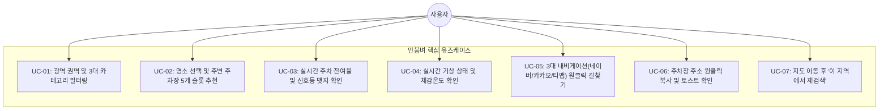

# 📋 요구사항 정의서 (Requirements Specification)
> **서비스명**: 안붐벼 (전국 실시간 축제·명소 밀집도 & 주차 정보 통합 플랫폼)  
> **최종 개정일**: 2026-08-24  
> **문서 버전**: v1.0.0

---

## 1. 시스템 목적 및 범위 (Scope)

본 시스템은 전국 단위의 축제, 공원, 문화시설 정보와 해당 명소의 주변 공영·민영 주차장 정보, 그리고 실시간 기상 데이터를 결합하여 사용자에게 이동 전/이동 중 최적의 주차 의사결정 경로를 제공하는 것을 목표로 합니다.

---

## 2. 사용자 유즈케이스 명세 (System Use Cases)



### UC-01: 광역 권역 및 3대 카테고리 필터링
- **설명**: 10개 광역 지역(서울, 경기·인천, 부산, 대구, 대전, 강원, 충청, 전라, 경상, 제주)과 3개 카테고리(축제, 공원·나들이, 문화·명소)를 선택하여 명소를 조회한다.
- **선행 조건**: 없음. 기본 접속 시 '서울' / '축제' 기본 선택.
- **결과**: 해당 조건에 부합하는 명소 목록이 지도와 하단 캐러셀에 실시간 반영된다.

### UC-02: 명소 선택 및 주변 주차장 5개 슬롯 추천
- **설명**: 지도 핀 또는 캐러셀 카드를 탭하여 특정 명소를 포커스한다.
- **결과**: 해당 명소 중심 반경 최단거리 5개 주차장 P 마커가 지도에 렌더링되며 바텀시트가 활성화된다.

### UC-03: 실시간 주차 잔여율 및 신호등 뱃지 확인
- **설명**: 5대 지자체 실시간 센서 연동 주차장의 잔여면수를 신호등 색상으로 직관적으로 파악한다.

### UC-04: 실시간 기상 상태 및 체감온도 확인
- **설명**: 명소 좌표 기준 기온, 체감온도, 날씨 아이콘/이모지를 카드 상단에서 확인한다.

### UC-05: 3대 내비게이션 원클릭 길찾기
- **설명**: 주차장 또는 명소의 '길찾기' 버튼 클릭 시 모달 팝업에서 카카오맵, 티맵, 네이버지도 중 원하는 내비게이션으로 목적지가 자동 세팅된 경로를 실행한다.

### UC-06: 주차장 주소 원클릭 복사
- **설명**: 주차장 주소 텍스트 터치 시 클립보드에 주소가 복사되고 2초간 안내 토스트가 표출된다.

### UC-07: 이 지역에서 재검색
- **설명**: 사용자가 지도를 자유롭게 드래그/줌 이동한 후 상단 '이 지역에서 재검색' 버튼을 눌러 현재 뷰포트 중심의 새로운 명소를 로드한다.

---

## 3. 주차 잔여율 산출 공식 및 3단계 신호등 뱃지 규격

### 3.1. 잔여율 산출 공식

$$\text{잔여율}(\%) = \left( \frac{\text{실시간 잔여면수}(\text{available})}{\text{총 주차면수}(\text{total})} \right) \times 100$$

### 3.2. 신호등 뱃지 판정 조건 명세

```typescript
function evaluateParkingStatus(parking: Parking): { label: string; badgeClass: string } {
  if (!parking.isLive || parking.availableSpots === null) {
    return {
      label: `총 ${parking.totalSpaces}면 (현장확인 ⚪)`,
      badgeClass: 'bg-slate-100 text-slate-700 border-slate-200',
    };
  }

  const available = parking.availableSpots;
  const total = parking.totalSpaces || 1;
  const rate = (available / total) * 100;

  // 1. 만차 (0면 주차 가능)
  if (available === 0) {
    return {
      label: `만차 🔴 (0/${total}면)`,
      badgeClass: 'bg-red-50 text-red-700 border-red-200',
    };
  }

  // 2. 혼잡 (잔여율 30% 미만 또는 잔여 1~9대)
  if (rate < 30 && available < 10) {
    return {
      label: `혼잡 🟠 (${available}/${total}면)`,
      badgeClass: 'bg-amber-50 text-amber-700 border-amber-200',
    };
  }

  // 3. 여유 (잔여율 30% 이상 또는 10대 이상)
  return {
    label: `여유 🟢 (${available}/${total}면)`,
    badgeClass: 'bg-emerald-50 text-emerald-700 border-emerald-200',
  };
}
```

---

## 4. 비기능적 요구사항 (Non-Functional Requirements)

| 항목 | 요구 수준 | 구현 전략 |
|---|---|---|
| **응답 성능** | 캐시 적중 시 < 10ms, 미적중 시 < 1,000ms | 60초 메모리 캐시 및 `Promise.allSettled` 비동기 병렬화 |
| **모바일 반응형** | 360px ~ 430px 모바일 화면 완벽 지원 | Tailwind `max-w-md mx-auto`, Safe Area Inset Insetting |
| **호환성** | iOS Safari, 안드로이드 크롬, 인앱 브라우저 지원 | 공식 웹/앱 통합 URL을 통한 딥링크 정규화 |
| **가용성** | 외부 공공 API 장애 시에도 서비스 무중단 | 타임아웃 가드 및 2단계 시설정보 Fallback |
| **코드 무결성** | TypeScript 100% Type-Safe, ESLint 0 Errors | 엄격한 인터페이스 정의 및 CI/CD 빌드 검증 |
