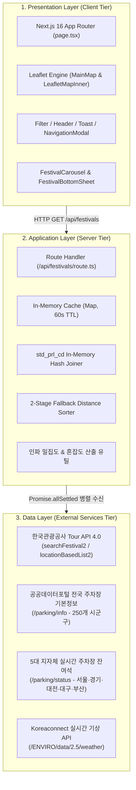

# 🏛️ 시스템 아키텍처 정의서 (System Architecture Document)
> **서비스명**: 안붐벼 (전국 실시간 축제·명소 밀집도 & 주차 정보 통합 플랫폼)  
> **최종 개정일**: 2026-08-24  
> **문서 버전**: v1.0.0

---

## 1. 개요 (System Overview)

'안붐벼'는 대형 지역 축제 및 도심 나들이 명소 방문객의 주차난과 현장 진입 혼잡을 해소하기 위한 위치 기반 실시간 통합 안내 서비스입니다. 한국관광공사 국문 관광정보, 국토교통부/한국교통안전공단 주차장 기본정보, 5대 광역 지자체(서울·경기·대전·대구·부산) 실시간 주차 센서 데이터, 그리고 Koreaconnect 기상 데이터를 실시간으로 수집·결합하여 단일 화면에서 제공합니다.

---

## 2. 계층형 아키텍처 (Layered Architecture)

시스템은 확장성, 유지보수성, 장애 격리성을 위해 3계층(Presentation / Application / Data Layer) 구조로 설계되었습니다.



### 2.1. Presentation Layer (클라이언트 계층)
- **프레임워크**: Next.js 16.3 (Turbopack, App Router)
- **상태 관리**: React Hooks (`useState`, `useCallback`, `useMemo`, `useEffect`)를 통한 경량 단일 상태 오케스트레이션
- **지도 엔진**: Leaflet 1.9 & React-Leaflet 기반 NoSSR 동적 임포트 렌더링
- **스타일링**: Tailwind CSS 4, Sandoll 어그로체(SBAggroB) 웹폰트, Lucide React Icons

### 2.2. Application Layer (서버 및 오케스트레이션 계층)
- **서버 엔진**: Next.js Server Route Handlers (`src/app/api/festivals/route.ts`)
- **캐싱 계층**: 60초 TTL 메모리 캐시(`apiCache`)로 외부 공공데이터 Rate Limit 보호 및 응답 레이턴시 99% 단축 (< 5ms)
- **조인 & 가중치 엔진**: `std_prl_cd` 키 기반 $O(1)$ 해시 조인 및 하버사인 거리 기반 2단계 슬롯 정렬

### 2.3. Data Layer (외부 공공데이터 계층)
- **한국관광공사 Tour API**: 전국 축제 및 문화·관광 POI 데이터 수집
- **주차장 기본정보 API**: 전국 250여 개 시군구 단위 공영/민영 주차장 시설 정보(총면수, 요금, 위치)
- **5대 지자체 실시간 잔여석 API**: 센서 연동 주차장 실시간 입출차 및 잔여면수 수집
- **기상 API**: 위경도 좌표 기준 실시간 기온, 체감온도, 기상 상태 매핑

---

## 3. System Context 및 2단계 데이터 소스 이중화 (Fallback)

지자체별 인프라 구축 격차(실시간 주차 센서 연동 유무)를 극복하기 위해 **2단계 주차 데이터 Fallback 아키텍처**를 적용합니다.

```
                  [ 사용자 위치 / 축제·명소 탐색 ]
                                │
                                ▼
               [ 반경 1km ~ 3km 이내 주차장 매핑 ]
                                │
        ┌───────────────────────┴───────────────────────┐
        ▼                                               ▼
[ 1단계: 5대 지자체 실시간 연동 ]             [ 2단계: 전국 기본정보 Fallback ]
  - 서울, 경기, 대전, 대구, 부산                - 강원, 충청, 전라, 경상, 제주 및
  - 센서 실시간 잔여석 산출                       센서 미연동 시설
  - 3단계 신호등 뱃지:                           - 시설 총면수 및 요금체계 표출
    🟢 여유 (≥ 30% 또는 10대 이상)               - ⚪ 현장확인 (총 N면)
    🟠 혼잡 (< 30% 또는 1~9대)
    🔴 만차 (0대)
```

| 구분 | 1단계: 실시간 연동 권역 | 2단계: 기본정보 Fallback 권역 |
|---|---|---|
| **대상 지역** | 서울특별시, 경기도, 대전광역시, 대구광역시, 부산광역시 | 강원, 인천(비연동구), 충청, 전라, 경상, 제주 및 전국 센서 미연동 시설 |
| **제공 데이터** | 실시간 잔여면수, 현재 주차대수, 실시간 갱신 시각 | 시설 총면수, 운영시간, 기본 요금 체계, 주차장 주소 |
| **UI 뱃지** | 🟢 여유 / 🟠 혼잡 / 🔴 만차 (신호등 3단계) | ⚪ 총 N면 (현장확인) |
| **안정성 보장** | 센서 미수신 또는 통신 실패 시 즉시 2단계 Fallback으로 자동 전환 | 데이터 누락 없이 100% 주변 주차장 목록 제공 |

---

## 4. 컴포넌트 간 상호작용 및 데이터 흐름

1. **사용자 인터랙션**: 지역 탭(예: '부산') 또는 카테고리(예: '공원·나들이') 클릭.
2. **API 호출**: `page.tsx` ➔ `fetchFestivals({ region: '부산', category: '공원·나들이' })`.
3. **서버 파이프라인**:
   - 60초 캐시 검사 ➔ Miss 시 Tour API + 부산 16개 구/군 주차장 정보 및 실시간 잔여석 API + 기상 API 병렬 수신.
   - `std_prl_cd` 키로 실시간 데이터 1:1 조인.
   - 각 공원 좌표 기준 최단거리 주차장 5개 슬롯 매핑.
4. **클라이언트 렌더링**:
   - `MainMap`: 명소 핀 렌더링.
   - `FestivalCarousel`: 명소별 최단거리 주차장 및 3단계 신호등 뱃지 카드 렌더링.
   - 사용자가 카드 또는 핀 선택 시 `selectedFestival`로 주차장 P 마커 5개 지도 동적 표출.
